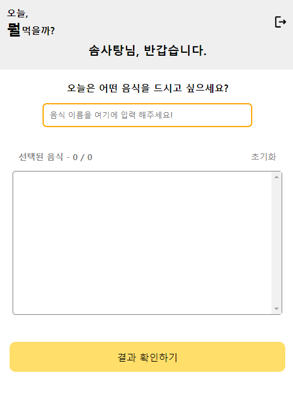

# Food-Recommend - 음식 추천 뽑기


<br>


What It is? : 어떤 음식을 먹을까 ?

## 최종 구현 화면

- netlify - [https://foodrecommend.netlify.app/](https://foodrecommend.netlify.app/)


### 홈(루트)


### 로그인 / 회원가입

<p align="left">


</p>


### 메인




<br>

## 프로젝트 진행 목적

- `React` `Typescript` 컴포넌트 모듈화
- `async`, `await`로 비동기 프로그래밍 코드 작성
- `vite create` 및 `netlify` 배포
- `firebase`로 로그인 기능 구현
- `모바일` 기준으로 제작된 웹 앱

<br>

## 구현 요구 사항 목록

- [✅] 컴포넌트 모듈화
- [✅] 로그인 기능 구현 (로그인, 로그아웃, 회원가입)
- [✅] 라우터별로 뷰 구현 (홈(루트), 로그인, 회원가입, 메인 등)
- [✅] 심플하고 가독성이 높은 UI
- [✅] 모바일 버전 기준을 고려한 웹 앱
- [✅] CSS module 관리로, 컴포넌트별 CSS 관리 편리 및 클래스 명의 전역 중복(오염) 방지
- [✅] 사용자의 편의성을 위한 입력한 음식 데이터를 골라서 랜덤 추출

<br>

## 사용한 프레임워크 및 라이브러리 설명

- React: 컴포넌트 기반의 화면구성, Virtual DOM으로 인한 속도 향상, SPA(싱글 페이지 애플리케이션)
- TypeScript: 초기 데이터와 컴포넌트 사이에 전달되는 데이터의 컴파일 오류를 방지하기 위해 사용
- Vite: build 속도를 빠르게 하기 위해 사용
- Firebase: 사용자 데이터 저장 및 로그인 기능 구현을 위해 사용

## 실행 방법

```
git clone https://github.com/sstipdev/food-recommendations

yarn -i

yarn run dev
```